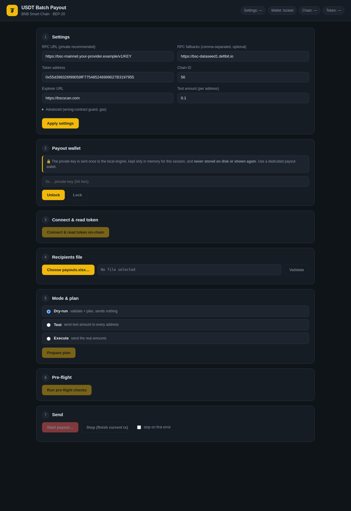

# USDT (BEP-20) Batch Payout — CLI + Desktop App

A production-ready tool for distributing **USDT (BEP-20) on BNB Smart Chain** to a
list of recipients from an Excel file. It ships in two forms that share the same
audited core:

- **Desktop app (Electron)** — a guided 7-step GUI ([jump to it](#desktop-app-gui)).
- **CLI** — scriptable, `--dry-run` → `--test` → `--execute`.

This tool moves **real money**. It is built so that the *default* action is to do
nothing dangerous: it validates everything first, runs a pre-flight balance/gas
check, requires an explicit confirmation, and keeps an idempotent ledger so a
crash or a `Ctrl+C` (or **Stop** in the GUI) can be safely resumed **without
double-paying anyone**.



> ⚠️ **USDT on BSC has 18 decimals, not 6.** Unlike USDT on Ethereum/Tron, the BSC
> contract (`0x55d398326f99059fF775485246999027B3197955`) uses 18 decimals. This
> tool never hard-codes decimals — it reads `symbol`/`decimals` **on-chain** and
> refuses to run if they don't match the expected values (wrong-contract guard).

---

## Safety model (read this first)

| Guard | Behavior |
| --- | --- |
| **Dry-run by default** | With no mode flag, nothing is ever sent. Real sends require `--execute` (or `--test`). |
| **Validate-then-send** | Every row is validated *before* the first transaction. One bad row ⇒ the whole run is rejected with a table of problems. |
| **On-chain token check** | `symbol`/`decimals` are read from the contract; a mismatch with `EXPECTED_SYMBOL`/`EXPECTED_DECIMALS` aborts the run. |
| **Pre-flight** | Checks the payout wallet holds enough USDT for the total and enough BNB for gas; otherwise stops and tells you how much to top up. |
| **Explicit confirmation** | Real sends need a typed `YES` (or `--yes` for automation). |
| **Idempotent ledger** | A SQLite ledger keyed by `(run_id, address)` skips anyone already paid. Re-running resumes from where it stopped. |
| **Receipt-verified success** | A payment counts as success only when the receipt `status === success` **and** a matching `Transfer` event is present — not the function return value. |
| **Kill switch** | `Ctrl+C` finishes the in-flight transaction, records it, and exits cleanly so the ledger stays consistent. |
| **Secrets stay secret** | The private key is read only from `.env` (CLI) or entered each launch and kept in memory (GUI) — never logged or written anywhere. `.env`, logs, the DB and spreadsheets are git-ignored. |

---

## Desktop app (GUI)

A cross-platform Electron app (built/tested for **Windows**) that walks you
through the same safe flow with live progress. It reuses the exact same core as
the CLI, so every guard above applies.

### Security model of the GUI

- The renderer is **sandboxed** with `contextIsolation: true`, `nodeIntegration:
  false` and `sandbox: true`. It has **no Node, no filesystem and no network**;
  it can only call a small, whitelisted set of functions exposed through a
  `contextBridge` preload. A strict Content-Security-Policy blocks remote/inline
  code, and navigation/popups are locked down.
- **The private key is entered once per launch and lives only in the main
  process's memory.** It is never written to disk, never returned to the UI,
  never logged, never serialized. Closing the app wipes it. (You chose
  "enter each launch" — nothing is persisted.)
- The ledger DB, per-run logs and `results.xlsx` are written under your OS user
  data folder (so a packaged install stays read-only and clean).

### Run it from source (dev)

```bash
npm install
npm run app:rebuild   # one-time: compiles better-sqlite3 for Electron's ABI
npm run app           # launches the desktop app
```

### Build a Windows installer (.exe)

On a Windows machine (electron-builder builds the installer for the OS it runs on):

```bash
npm install
npm run dist:win      # produces dist-app/USDT Batch Payout Setup <version>.exe (NSIS)
```

> **Native module note.** `better-sqlite3` is a native addon and must match the
> runtime's ABI. `npm run app:rebuild` builds it for Electron; if you then want to
> use the **CLI** again under plain Node, run `npm rebuild better-sqlite3` to
> switch it back. Packaging (`npm run dist:win`) rebuilds it for the bundled
> Electron automatically. Build the Windows installer **on Windows** (electron
> builds for the host OS).

Hardening & signing:

- The packaged binary is hardened with **Electron fuses** (`scripts/afterPack.cjs`):
  `RunAsNode`, the Node-options env var and the Node CLI inspector are disabled, so
  the installed app can't be coerced into a generic Node process to read the
  in-memory key.
- The installer is **unsigned** by default (personal use), so Windows SmartScreen
  may warn on first run. To sign it, see `build/README.md`. An app icon can be
  added at `build/icon.ico` (also see `build/README.md`).

### Troubleshooting the build (Windows)

**`'electron-builder' is not recognized`** — `npm install` didn't finish, so the
local binaries aren't there yet. Fix the install error below first; then
`npm run dist:win` works.

**`better-sqlite3` fails with `No prebuilt binaries found` / `Could not find any
Visual Studio installation`** — this happens when the Node version has no
matching `better-sqlite3` prebuilt, so npm tries to compile from source (which
needs Visual Studio C++). This repo pins `better-sqlite3@^12`, which ships
prebuilt binaries for **Node 20, 22 and 24** (and for Electron), so a clean
install needs **no compiler**:

```powershell
git pull
Remove-Item -Recurse -Force node_modules   # clear the half-broken install
npm install
npm run app:rebuild     # build better-sqlite3 for Electron (also no compiler)
npm run app             # or: npm run dist:win
```

If you're on an even newer Node with no prebuilt yet, either install **Node.js
22 LTS** (recommended) or install **Visual Studio Build Tools** with the
"Desktop development with C++" workload.

**`npm warn cleanup ... EPERM: operation not permitted, rmdir`** — files were
locked during install. Close the app/editor (and any running `npm run app`),
and prefer a path **outside OneDrive** — `C:\Users\…\Desktop` is often
OneDrive-synced, which locks files mid-build. Move the project to e.g.
`C:\dev\Sendingmoney` (or pause OneDrive), then reinstall.

> For `npm run dist:win` alone you can skip `app:rebuild` — electron-builder
> rebuilds the native module for Electron during packaging. `app:rebuild` is
> only needed before running `npm run app` in dev.

### Using the app

The window guides you top-to-bottom; each step unlocks the next:

1. **Settings** — RPC URL (private recommended), optional fallbacks, token/chain
   (BSC USDT pre-filled), test amount → *Apply settings*.
2. **Payout wallet** — paste the private key → *Unlock* (the field is wiped
   immediately; only the derived address is shown).
3. **Connect & read token** — reads `symbol`/`decimals` on-chain, runs the
   wrong-contract guard, shows balances.
4. **Recipients file** — choose `payouts.xlsx` → *Validate* (errors are listed in
   a table; duplicates can be summed or rejected).
5. **Mode & plan** — pick Dry-run / Test / Execute → *Prepare plan* (shows totals
   and how many are already paid).
6. **Pre-flight** — verifies USDT + BNB balances vs. the run.
7. **Send** — for Test/Execute you must type **YES** to confirm; a live table
   shows each transfer with its BscScan link, a progress bar and counts. **Stop**
   finishes the in-flight tx and halts cleanly; just run again to resume.

---

## Requirements

- Node.js ≥ 20
- A funded payout wallet (USDT for the payments + a little BNB for gas)
- A BSC RPC endpoint — a **private/paid** one is strongly recommended (public
  endpoints rate-limit hard on 200–300 sequential sends + receipt polling)

## Install

```bash
npm install
cp .env.example .env      # then edit .env (PRIVATE_KEY, RPC_URL, ...)
```

## Configure (`.env`)

| Key | Default | Notes |
| --- | --- | --- |
| `PRIVATE_KEY` | — | Dedicated payout wallet key. **Required for `--test`/`--execute`.** Never commit it. |
| `RPC_URL` | — | Primary BSC RPC (private recommended). |
| `RPC_FALLBACKS` | — | Optional comma-separated fallback RPCs; rotated on rate-limit/timeout. |
| `TOKEN_ADDRESS` | `0x55d3…7955` | USDT BEP-20. |
| `CHAIN_ID` | `56` | BNB Smart Chain. |
| `EXPLORER_URL` | `https://bscscan.com` | Used to build tx links. |
| `EXPECTED_SYMBOL` / `EXPECTED_DECIMALS` | `USDT` / `18` | Wrong-contract guard. |
| `TEST_AMOUNT` | `0.1` | Amount sent to each address in `--test` mode. |
| `MAX_RETRIES` | `5` | Retries for transient RPC errors. |
| `GAS_LIMIT_PER_TX` | `100000` | Generous fixed gas limit (unused gas is refunded). |
| `GAS_PRICE_MULTIPLIER` | `1.1` | Headroom over the network gas price. |

## Input file (`payouts.xlsx`)

First row is headers. Required columns: **`address`** and **`amount`** (extra
columns like `note` are ignored; blank rows are ignored).

| address | amount | note |
| --- | --- | --- |
| 0x8894…D4E3 | 12.5 | invoice #1002 |
| 0xF977…aceC | 100 | refback |

Generate a ready-made example to copy from:

```bash
npm run make-example          # writes payouts.example.xlsx
cp payouts.example.xlsx payouts.xlsx
```

---

## Usage — run it in this order

### 1. Dry-run (default) — validate + plan, send nothing

```bash
node src/cli.js --dry-run --file payouts.xlsx
# or simply:  npm run payout
```

Prints the validated plan, the pre-flight summary (balances, total, gas budget)
and stops. **No transactions.** Fix any reported problems before continuing.

### 2. Test — send `TEST_AMOUNT` to every real address (cheap end-to-end check)

```bash
node src/cli.js --test --file payouts.xlsx
```

Sends `TEST_AMOUNT` (e.g. `0.1 USDT`) to **each** address using a **separate
ledger**, so you can confirm the whole pipeline works against the real recipient
list for a few dollars before the real distribution.

### 3. Execute — the real distribution

```bash
node src/cli.js --execute --file payouts.xlsx
```

Runs pre-flight, asks you to type `YES`, then pays the real amounts sequentially.
At the end it writes **`results.xlsx`** (the receipt) and prints a summary of
succeeded / failed / skipped, total USDT sent and gas used. Any failures are
listed separately — **just re-run the same command to retry only those** (paid
addresses are skipped automatically).

### Options

```
--dry-run            Validate + plan, no sends (default).
--test               Send TEST_AMOUNT to every address (isolated ledger).
--execute            Send the real amounts.
--file <path>        Input spreadsheet (default: payouts.xlsx).
--yes                Skip the interactive YES confirmation (automation).
--stop-on-error      Halt on the first failed transfer instead of continuing.
--duplicates <mode>  Duplicate addresses: "reject" (default) or "sum".
--help               Show help.
```

---

## How resume / idempotency works

Each run gets a deterministic `run_id` derived from the recipient list + token +
chain + mode. Before sending to an address the tool checks the ledger; if that
address already has a **success** row for this `run_id`, it is skipped. So:

- A crash, RPC outage or `Ctrl+C` partway through is safe — re-run the same
  command and it continues from the next unpaid address.
- Failed (reverted / not-confirmed) addresses are **not** marked paid, so a
  re-run retries them.
- `--test` and `--execute` use different `run_id` namespaces, so a test run never
  marks anyone as "paid" for the real run.

## Handling the edge cases

- **Duplicate addresses** — detected and reported; choose `--duplicates sum` to
  add their amounts or `reject` (default) to stop. Interactively you'll be asked.
- **Too many decimals / zero / empty / non-numeric amounts** — rejected during
  validation with the exact row number.
- **Wrong checksum** — a mixed-case address with a bad checksum is rejected;
  valid addresses are normalized to checksum form.
- **RPC down / rate-limited mid-run** — transient errors (timeout, 429,
  `replacement underpriced`, `nonce too low`, …) are retried with exponential
  backoff and the endpoint is rotated if `RPC_FALLBACKS` is set.
- **Not enough BNB / USDT** — caught in pre-flight before anything is sent; for
  BNB it tells you how much to add.
- **Nonce drift** — sending uses a manual nonce starting from the wallet's
  pending nonce; after an un-broadcast failure the nonce is re-synced from the
  node.

## Output & logging

- **Console + log file** — every run writes a timestamped log to `logs/`
  (`payout-<mode>-<timestamp>.log`) with recipient, amount, tx hash, explorer
  link and status.
- **`results.xlsx`** (`results-test.xlsx` for test mode) — address, amount,
  status, tx_hash, explorer link, gas used, error, timestamp. Use it for
  refback accounting.

## Project structure

```
src/
  cli.js        CLI entry: argument parsing + orchestration (the safety order).
  engine.js     Stateful programmatic facade used by the GUI (same safety order);
                holds the private key in memory only, returns JSON-safe results.
  config.js     Loads/validates config from .env (CLI) or an object (GUI); never logs the key.
  parse.js      Reads the .xlsx and validates EVERY row (collects all errors).
  chain.js      viem clients, RPC failover + retry, token reads, send + receipt verify.
  preflight.js  Balance/gas checks and the pre-flight summary.
  ledger.js     SQLite idempotency ledger + deterministic run_id.
  payout.js     Sequential, idempotent, manual-nonce send engine + kill switch + event stream.
  report.js     results.xlsx exporter.
  logger.js     Per-run file + console logger.
  util.js       Decimal-safe amount parsing and table rendering.
electron/
  main.cjs      Electron main process: owns the engine + key, whitelisted IPC handlers.
  preload.cjs   contextBridge: the only renderer↔main surface (no raw ipc, no Node).
renderer/
  index.html    The GUI (strict CSP, no inline scripts).
  styles.css    Dark theme.
  app.js        UI logic — calls window.api.*, renders live progress.
scripts/
  make-example.js   Generates payouts.example.xlsx.
test/
  offline.test.mjs  No-network tests (precision, validation, dupes, ledger). `npm test`.
```

## Testing

```bash
npm test     # offline suite: amount precision, validation, duplicates, ledger idempotency
```

## Security notes

- The **private key** is never logged, printed or written to the ledger/results.
  In the **CLI** it is read only from `.env` (git-ignored); in the **GUI** it is
  entered each launch and kept only in main-process memory (never persisted). Use
  a **dedicated** payout wallet that holds only the funds for this distribution.
- The **GUI renderer** is sandboxed (`contextIsolation`, no `nodeIntegration`,
  `sandbox: true`) with a strict CSP and locked-down navigation; it reaches the
  engine only through a minimal whitelisted preload bridge.
- `.gitignore` excludes `.env`, `*.log`, the SQLite DB, `payouts.xlsx`,
  `results*.xlsx` and the Electron `dist-app/` output so recipient data and
  secrets are never committed.
- **Dependency advisories:** `npm audit` reports issues in `xlsx` (SheetJS), a
  transitive `ws` (via `viem`), and several in **electron-builder** dev deps. The
  electron-builder advisories are **dev-only** (build tooling, not shipped in the
  app). The spreadsheet is your own local, trusted file and the RPC transport is
  HTTP-only (the vulnerable `ws` WebSocket path is unused), so the practical risk
  is low. For a clean SheetJS audit, install its official CDN build
  (`npm i https://cdn.sheetjs.com/xlsx-0.20.3/xlsx-0.20.3.tgz`).
- Always do **Dry-run**, then **Test**, then **Execute**.
